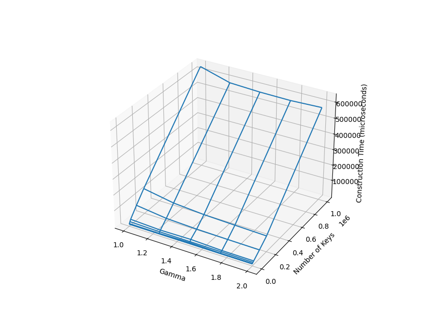

# BBHash
Implementation of the BBHash algorithm as described in "Fast and scalable minimal perfect hashing for massive key sets" by Limasset, et al. (2017)

I timed this implementation with various values of gamma (1, 1.25, 1.5, 1.75, and 2) and numbers of keys ranging from 100 to 1 |000 |000. In particular , I tested by loading in n words from this list of English words: <https://github.com/dwyl/english-words/blob/master/words.txt>. This algorithm worked surprisingly fast given the sizes of the inputs, and running tests was pretty fast. After running these trials, I got the following data:

| Size | 1 | 1.25 | 1.5 | 1.75 | 2 |
| --- | --- | --- | --- | --- | --- |
| 100 | 451 | 294 | 446 | 226 | 231 |
| 200 | 786 | 590 | 657 | 200 | 196 |
| 1,000 | 1821 | 1132 | 2044 | 942 | 885 |
| 2,000 | 3102 | 2139 | 5810 | 1733 | 1542 |
| 10,000 | 12516 | 8513 | 8159 | 7074 | 5461 |
| 20,000 | 23746 | 15254 | 18179 | 10797 | 9670 |
| 100,000 | 81213 | 57314 | 49584 | 46197 | 43656 |
| 200,0000 | 148708 | 114600 | 100367 | 93892 | 88155 |
| 1,000,000 | 638904 | 583809 | 574113 | 570949 | 577727 |

To make sense of the results, I plotted them in a graph shown below:

From my limited data, construction seems to take linear time.
